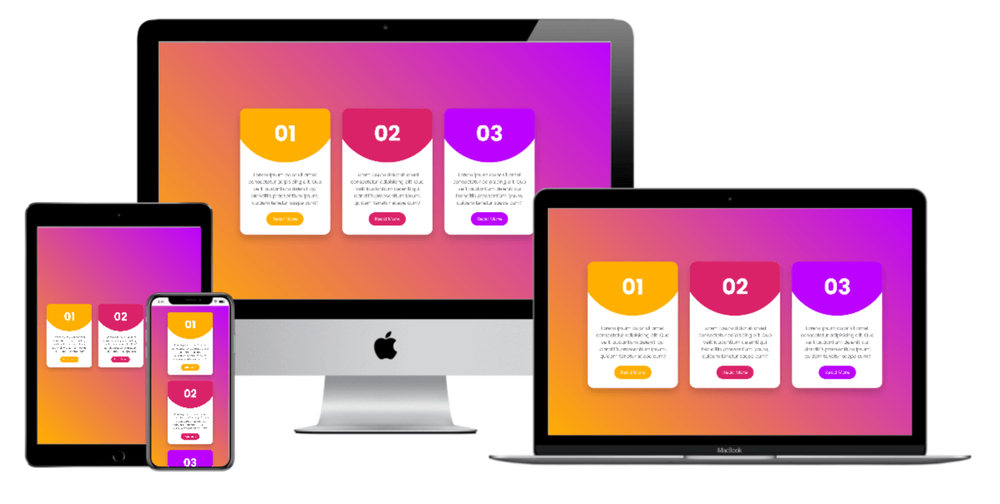

<h1 align = "center">
 
  
   
     
  Responsive CARD UI - CSS Hover Effects
   
</ H1>

<h3 align = "center"> User Centric Front End Development </h3>

## Color Generator

transition, filter, blur

## Project Specifications

- A hover effect is initiated when user interacts with a card